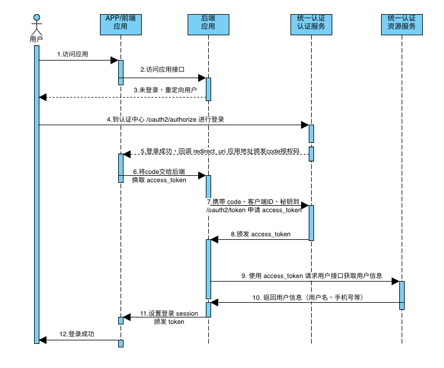

# 统一认证平台SDK集成开发包

[](https://central.sonatype.com/artifact/net.renfei/unifi-auth-sdk)
[](https://coveralls.io/github/renfei/unifi-auth-sdk?branch=master)
[](https://codebeat.co/projects/github-com-renfei-unifi-auth-sdk-master)

> 此项目并非完整开源项目，此开发包是为了方便向我组织内部的统一认证平台(闭源项目)第三方对接使用的开发包。

如果你对SDK需要修改，请到GitHub上Fork进行修改，然后向我提交PR请求。Gitee、GitLab均为镜像仓库，不接受任何 PR、MR 请求。

由于需要上传到 Maven 中央仓库，需要对域进行验证，所以包名设定为```net.renfei```进行签名并上传 Maven 中央仓库。

代码仓库镜像：

* [https://github.com/renfei/unifi-auth-sdk](https://github.com/renfei/unifi-auth-sdk)
* [https://gitee.com/rnf/unifi-auth-sdk](https://gitee.com/rnf/unifi-auth-sdk)
* [https://gitlab.com/renfei/unifi-auth-sdk](https://gitlab.com/renfei/unifi-auth-sdk)

## 安装

最新版本号可在中央仓库中查询: [https://central.sonatype.com/artifact/net.renfei/unifi-auth-sdk](https://central.sonatype.com/artifact/net.renfei/unifi-auth-sdk)

### Maven安装

```xml
<dependency>
    <groupId>net.renfei</groupId>
    <artifactId>unifi-auth-sdk</artifactId>
    <version>1.5.1</version>
</dependency>
```

### Gradle安装

```gradle
dependencies{
	implementation group: 'net.renfei', name: 'unifi-auth-sdk', version: '1.5.1'
}
```

### 手动安装

如果您不使用任何版本依赖管理软件，您希望手动下载```jar```包放入```lib```文件夹，您可以到以下位置下载，我们目前只提供```Java1.8```的编译版本：

* Maven 中央仓库：[https://central.sonatype.com/artifact/net.renfei/unifi-auth-sdk](https://central.sonatype.com/artifact/net.renfei/unifi-auth-sdk)
* GitHub 包制品：[https://github.com/renfei/unifi-auth-sdk/packages/](https://github.com/renfei/unifi-auth-sdk/packages/)
* GitLab 包制品：[https://gitlab.com/renfei/unifi-auth-sdk/-/packages](https://gitlab.com/renfei/unifi-auth-sdk/-/packages)


### 使用SDK包

请参见示例项目：

* [spring-boot-example](example/spring-boot-example)

## 自定义实现

如果您不希望使用我的 SDK 包，您可以自己实现与统一认证平台的对接。

认证流程序列图：



### 构建授权请求

当用户未登录您的系统，您希望得到用户授权获取用户信息时，需要构建一个授权请求地址，将用户引导到统一认证平台，构建过程如下：

* 统一平台地址(固定值)：```https://auth.renfei.net```
* 授权端点地址(固定值)：```/oauth2/authorize```
* 用户授权类型(固定值)：```response_type=code```
* 您的客户端ID(必选值)：```client_id=fec01ad39c9e495082ac74a861588d25```
* 您的回调地址(必选值)：```redirect_uri=https://www.renfei.net/authenticate```
* 您请求的权限(必选值)：```scope=user.read```
* 您附带的信息(可选值)：```state=123```

其中，```state```参数为可选值，您可以设置任意值，在授权成功后回调地址中将携带您自定义的```state```参数。

构建结果为：```https://auth.renfei.net/oauth2/authorize?response_type=code&client_id=fec01ad39c9e495082ac74a861588d25&redirect_uri=https://www.renfei.net/authenticate&scope=user.read&state=123```

将用户引导到统一认证平台，用户授权后将回调您的预留地址，您可获得```code```授权码，通过```code```授权码可换取 Token，进一步操作统一认证平台的其他接口。

### 端点

所有请求需要设置 ```Basic Auth``` 认证，用户名为您在统一认证平台的客户端ID，密码为您在统一认证平台的客户端密码。

* ```/oauth2/token```：使用授权码换取 Token，```POST```请求 ```x-www-form-urlencoded``` 编码，参数为：
  * ```grant_type```：固定值 ```authorization_code```
  * ```client_id```：您在统一认证平台的客户端ID
  * ```redirect_uri```：您在统一认证平台预留的回调地址
  * ```code```：您获取到的用户授权码

## 版本里程

* 1.0.x: 实现统一认证平台的用户授权、登录
